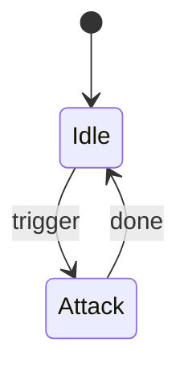

# State machines
Node names under each StateMachine match these labels exactly.
## <Entity>

```mermaid
stateDiagram-v2
[*] --> Idle
Idle --> Attack: trigger
Attack --> Idle: done
```
Rules that cut across states: <for example, only Dodge sets the hurtbox
invulnerable>.